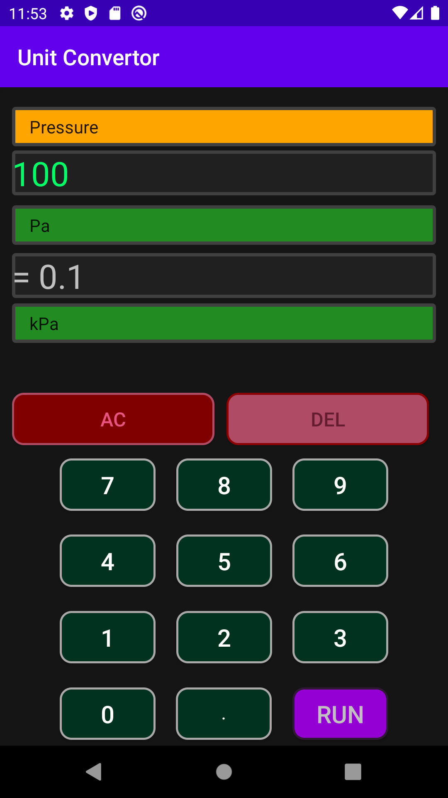

# University of Ottawa - SEG2105 - Final Project - Mobile app design - Unit converter
# Author: Isaac Choi

**Manual testing instruction:**

Disclaimer: Although this app is written in the Java language, the following test cases are only for running it on an Android device or an Android emulator (e.g. the one built-in Android Studio). The expected results that will be presented in this section are the results tested using an Android emulator. 

--------------------------------------------------------------------------------------------------------------------------------------------------------------------------

**Testcase 01**:

System: Unit Convertor 

*Lanuching the app*

Severity: 1

**Instructions**:

1.    On Android Studio, press Run

**Expected result**:

1.   The app loads into the UI. One should observe 3 drop-down lists shown on top of the screen (one in orange, two in green), 2 text boxes in black background (i.e. screen), and numeric keypad (i.e. numpad) with operation buttons located below text boxes. The orange list should display with text: 'Click to select category:'. Shown in the image below. 

      

**Cleanup**:

1.   Close the app if not proceeding to test subsequent cases.

--------------------------------------------------------------------------------------------------------------------------------------------------------------------------

**Test case 02**:

System: Unit Convertor 

*Select item from a drop-down list*

Severity: 2

**Instructions**:

1.    If not proceeding from Testcase 01: On Android Studio, press Run (Testcase 01, instruction 1)
2.    Click on the orange drop-down list
3.    Select Pressure

**Expected result**:

1.   The text of the orange drop-down list should change to: 'Pressure'
2.   Each of the two green drop-down lists should display text: 'Click to select a unit':

 
                                        

**Cleanup**:

1.   Close the app if not proceeding to test subsequent cases.

--------------------------------------------------------------------------------------------------------------------------------------------------------------------------

**Test case 03**:

System: Unit Convertor 

*Select items from different drop-down lists*

Severity: 2

**Instructions**:

1.    If not proceeding from Testcase 02: On Android Studio, press Run (Testcase 02, instruction 1)
2.    Click on the orange drop-down list and select pressure (Testcase 02. instructions 2 and 3)
3.    Click on the first green drop-down list and select Pa
4.    Similarly, click on the second green drop-down list and select kPa

**Expected result**:

1.   The text of the orange drop-down list should change to: 'Pressure'
2.   The text of the first green drop-down list should change to: 'Pa'
3.   The text of the second green drop-down list should change to: 'kPa'

 

**Cleanup**:

1.   Close the app if not proceeding to test subsequent cases.

--------------------------------------------------------------------------------------------------------------------------------------------------------------------------

**Test case 04**:

System: Unit Convertor 

*Test numeric keypad input*

Severity: 2

**Instructions**:

1.    If not proceeding from Testcase 01: On Android Studio, press Run (Testcase 02, instruction 1)
2.    Using the numpad button located at the button of the screen, input 100 

**Expected result**:

1.    The first screen should display text: '100' in green colour

 

**Cleanup**:

1.   Close the app if not proceeding to test subsequent cases.

--------------------------------------------------------------------------------------------------------------------------------------------------------------------------

**Test case 05**:

System: Unit Convertor 

*Test run button* 

Severity: 2

**Instructions**:

1.    If not proceeding from Testcase 04: On Android Studio, press Run (Testcase 04, instruction 1)
2.    Using the numpad button located at the button of the screen, input 100 (Testcase 04, instruction 2)
3.    Press the purple 'RUN' button located at the bottom left of the screen

**Expected result**:

1.    The first screen should display text: '100' in green colour
2.    The second screen should display text: 'Please select a category first!'

 

**Cleanup**:

1.   Close the app if not proceeding to test subsequent cases.

--------------------------------------------------------------------------------------------------------------------------------------------------------------------------

**Test case 06**:

System: Unit Convertor 

*Test converting pressure*

Severity: 3

**Instructions**:

1.    If not proceeding from Testcase 03: On Android Studio, press Run (Testcase 03, instruction 1)
2.    Click on the orange drop-down list and select pressure (Testcase 03. instructions 2)
3.    Click on the first green drop-down list and select 'Pa' (Testcase 03. instructions 3)
4.    Similarly, click on the second green drop-down list and select 'kPa' (Testcase 03. instructions 4)
5.    Using the numpad to input '100' (Testcase 04, instruction 2)
6.    Press the purple 'RUN' button located at the bottom left of the screen (Testcase 05, instruction 3)

**Expected result**:

1.   The text of the orange drop-down list should change to: 'Pressure'
2.   The text of the first green drop-down list should change to: 'Pa'
3.   The text of the second green drop-down list should change to: 'kPa'
4.   The first screen should display text: '100' in green colour
5.   The second screen should display text: '0.1' in grey colour

 

**Cleanup**:

1.   Close the app if not proceeding to test subsequent cases.

--------------------------------------------------------------------------------------------------------------------------------------------------------------------------

**Test case 07**:

System: Unit Convertor 

*Test converting length*

Severity: 3

**Instructions**:

1.    If not proceeding from Testcase 03: On Android Studio, press Run (Testcase 03, instruction 1)
2.    Click on the orange drop-down list and select 'Length' (Testcase 03. instructions 2)
3.    Click on the first green drop-down list and select 'm' (Testcase 03. instructions 3)
4.    Similarly, click on the second green drop-down list and select 'inch' (Testcase 03. instructions 4)
5.    Using the numpad to input '1' (Testcase 04, instruction 2)
6.    Press the purple 'RUN' button located at the bottom left of the screen (Testcase 05, instruction 3)

**Expected result**:

1.   The text of the orange drop-down list should change to: 'Length'
2.   The text of the first green drop-down list should change to: 'm'
3.   The text of the second green drop-down list should change to: 'inch'
4.   The first screen should display text: '1' in green colour
5.   The second screen should display text: '39.37' in grey colour

 

**Cleanup**:

1.   Close the app if not proceeding to test subsequent cases.

--------------------------------------------------------------------------------------------------------------------------------------------------------------------------

**Test case 08**:

System: Unit Convertor 

*Test converting velocity*

Severity: 3

**Instructions**:

1.    If not proceeding from Testcase 03: On Android Studio, press Run (Testcase 03, instruction 1)
2.    Click on the orange drop-down list and select 'Velocity' (Testcase 03. instructions 2)
3.    Click on the first green drop-down list and select 'km/h' (Testcase 03. instructions 3)
4.    Similarly, click on the second green drop-down list and select 'm/s' (Testcase 03. instructions 4)
5.    Using the numpad to input '1' (Testcase 04, instruction 2)
6.    Press the purple 'RUN' button located at the bottom left of the screen (Testcase 05, instruction 3)

**Expected result**:

1.   The text of the orange drop-down list should change to: 'Velocity'
2.   The text of the first green drop-down list should change to: 'km/h'
3.   The text of the second green drop-down list should change to: 'm/s'
4.   The first screen should display text: '5' in green colour
5.   The second screen should display text: '1.38888889' in grey colour

 

**Cleanup**:

1.   Close the app if not proceeding to test subsequent cases.

--------------------------------------------------------------------------------------------------------------------------------------------------------------------------

**Test case 09**:

System: Unit Convertor 

*Test converting volumetric flow rate*

Severity: 3

**Instructions**:

1.    If not proceeding from Testcase 03: On Android Studio, press Run (Testcase 03, instruction 1)
2.    Click on the orange drop-down list and select 'Volumetric flow rate' (Testcase 03. instructions 2)
3.    Click on the first green drop-down list and select 'm3/s' (Testcase 03. instructions 3)
4.    Similarly, click on the second green drop-down list and select 'L/min' (Testcase 03. instructions 4)
5.    Using the numpad to input '1' (Testcase 04, instruction 2)
6.    Press the purple 'RUN' button located at the bottom left of the screen (Testcase 05, instruction 3)

**Expected result**:

1.   The text of the orange drop-down list should change to: 'Volumetric flow rate'
2.   The text of the first green drop-down list should change to: 'm3/s'
3.   The text of the second green drop-down list should change to: 'L/min'
4.   The first screen should display text: '0.5' in green colour
5.   The second screen should display text: '30000.0' in grey colour

 

**Cleanup**:

1.   Close the app if not proceeding to test subsequent cases.

--------------------------------------------------------------------------------------------------------------------------------------------------------------------------

**Software architecture**:

* Client-server
* General hierachy

**Future development of this software**

* Include more measurement units in existing category (e.g. bar, Torr, Ba for pressure)
* Include more measurement categories (e.g. viscosity, density, force, momentum, etc.)

**About modifiying this software**:

* Modify this element in each drop-down list in the default strings module  
* Identify the conversion constants for new categories/units that is newly implemented to the system

